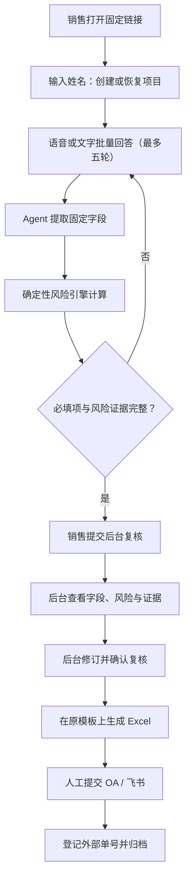

# 亚信域外合同前置审批助手

面向公司内网部署的域外合同前置审批系统。系统固定使用“2025 年 11 月启用”的审批表，通过销售访谈采集信息、确定性风险规则预审、后台人工复核，并在不改变原表格式的前提下导出 Excel。

技术栈保持为 Next.js 16、React 19、Vercel AI SDK 7 `ToolLoopAgent`、Tailwind CSS 4、Vitest 和 SheetJS/OpenXML。

## 当前支持范围

- 固定模板：`data/templates/preaudit-2025-11.xlsx`
- 固定销售入口：`/s/preaudit202511`
- 销售姓名恢复尚未送复核的填写记录
- 文字访谈与浏览器 Web Speech 中文语音输入
- Agent 结构化提取、五轮内批量追问和项目说明草拟
- 八组确定性风险规则和证据缺项检查
- 后台字段修订、风险重算、复核意见和状态流转
- 在原始 Excel 上填写数据，保留样式、合并单元格和批注
- 项目 JSON 文件持久化、导出后人工提交、外部单号归档

当前不支持任意上传/删除模板，也没有接入真实 OA 或飞书审批单接口。2026 年 8 月 Markdown 模板在复核导出时会同步生成同内容飞书文档，但导出成功只表示进入“待人工提交”，不能视为外部审批已发起。

## 业务流程



项目状态依次为：`访谈中` → `待补充信息` → `待后台复核` → `已复核` → `待人工提交` → `已归档`。

销售访谈最多五轮。普通轮次展示 6～10 个简短编号问题，支持一次文字或语音批量回答；采购与垫资条件会在前两轮确认，后续自动展开适用问题。第 5 轮一次列出全部剩余适用项，之后不再生成第 6 轮；若提前收集完整则直接进入送审确认。

## 风险规则

风险结论只来自代码中的固定规则，Agent 不能自行改变命中结果或等级：

1. 客户信用与回款健康度
2. 签约链条、上游签署和资金落实
3. 付款条件、预付款与背靠背安排
4. 项目利润率（GM1）
5. 纯采购、外采占比与核心交付责任
6. 供应商资信、实缴资本和主体类型
7. 采购付款、提前采购与垫资
8. 未经许可的二次分包

具体阈值和证据字段见 `src/domain/preaudit/risk-engine.ts`。

## 内网部署

### 1. 环境要求

- Node.js 20 或更高版本
- pnpm 10
- 可访问所配置 OpenAI 兼容模型服务的内网出口或内网模型网关
- 持久化磁盘目录，用于保存项目状态

### 2. 安装

```bash
pnpm install --frozen-lockfile
```

### 3. 配置

在项目根目录创建 `.env.local`（不要提交到 Git）：

```env
# OpenAI 兼容 LLM
LLM_API_BASE_URL=https://your-internal-llm.example.com/v1
LLM_API_KEY=replace-me
LLM_MODEL=replace-me

# 项目状态目录；生产环境必须放在持久化磁盘
PREAUDIT_DATA_DIR=/srv/preaudit/state

# 后台与后台 API 的 HTTP Basic Auth（生产环境必填，缺失时后台返回 503）
PREAUDIT_ADMIN_USER=reviewer
PREAUDIT_ADMIN_PASSWORD=replace-with-a-long-random-password

# 语音录音通过服务端上传转写，不依赖浏览器厂商的在线语音服务
TRANSCRIPTION_API_KEY=replace-me
TRANSCRIPTION_API_BASE_URL=https://api.siliconflow.cn/v1
TRANSCRIPTION_MODEL=FunAudioLLM/SenseVoiceSmall
TRANSCRIPTION_FALLBACK_MODEL=TeleAI/TeleSpeechASR
TRANSCRIPTION_LANGUAGE=zh-CN
# 服务器需将 ffmpeg 加入 PATH；未安装时可设为 false
# 默认转换为 16kHz 单声道 32kbps MP3
TRANSCRIPTION_NORMALIZE_AUDIO=true
```

后台设置页只展示当前生效配置。生产环境必须通过环境变量或密钥管理系统修改模型参数，避免后台请求将密钥或流量切换到未授权地址。

### 客户评级 CLI 接口

客户评级保留原始值，并通过统一解析器输出标准 JSON。未来接入客户评级系统时，可让外部程序调用该命令或复用相同字段协议：

```bash
npm run customer-rating -- "一级黑名单客户"
```

输出示例：

```json
{"input":"一级黑名单客户","canonical":"E","recognized":true,"blacklisted":true,"source":"local-rule"}
```

无法在本地映射的非空评级会返回 `source: "external-pending"`，作为后台人工核验提示保留，但不会被当作“字段缺失”阻断送审。

### 4. 构建与启动

Windows 本地运行建议直接双击项目根目录的 `启动亚信前置审批.cmd`。该入口会检查服务是否已运行；未运行时会打开独立的“Preaudit Service”窗口启动开发服务，健康检查通过后自动打开 `/admin`。服务运行期间不要关闭该窗口。

```bash
pnpm test
pnpm lint
pnpm build
pnpm start --hostname 0.0.0.0 --port 3000
```

建议由 Nginx 或公司统一网关提供 HTTPS、访问控制和反向代理：

- 管理端：`https://<内网域名>/admin`
- 销售端：`https://<内网域名>/s/preaudit202511`

应用使用 HTTP Basic Auth 保护 `/admin` 和 `/api/admin/*`；生产环境缺少账号或密码时会拒绝后台访问。仍建议由公司网关提供 HTTPS，并叠加 VPN、IP 白名单或统一身份认证。

## 数据与备份

项目数据存放在 `${PREAUDIT_DATA_DIR}/projects.json`。写入时使用临时文件和原子替换，避免中途写坏；这不替代备份。

生产建议：

- 将 `PREAUDIT_DATA_DIR` 放到持久化磁盘，不要使用容器临时层；
- 每日备份 `projects.json`，并保留至少一个月版本；
- 备份恢复前停止应用写入，恢复后先执行 JSON 校验和抽样查询；
- 限制状态目录仅运行账户可读写；
- 定期在隔离环境验证备份可以恢复。

原始模板受测试保护：导出前会检查固定锚点，测试同时校验样式、合并单元格、批注和源文件哈希未被修改。

## 主要接口

| 方法 | 路径 | 说明 |
| --- | --- | --- |
| GET | `/api/s/preaudit202511` | 获取固定模板字段 |
| POST | `/api/s/preaudit202511/start` | 创建或恢复项目 |
| POST | `/api/s/preaudit202511/chat` | Agent 流式访谈 |
| POST | `/api/s/preaudit202511/prepare-review` | 完整性检查并送后台复核 |
| GET | `/api/admin/projects` | 查询项目，可按状态筛选 |
| GET/PATCH | `/api/admin/projects/:id` | 查看或修订字段 |
| POST | `/api/admin/projects/:id/review` | 确认后台复核 |
| POST | `/api/admin/projects/:id/export` | 导出原表并转待人工提交 |
| POST | `/api/admin/projects/:id/archive` | 记录人工提交并归档 |
| GET | `/api/admin/templates` | 获取固定模板摘要 |
| GET | `/api/admin/templates/source` | 下载未修改的源模板 |

API 错误统一返回 `{ "error": { "code": "...", "message": "..." } }`。

## 项目结构

```text
src/
├── app/
│   ├── admin/                    # 内网复核工作台
│   ├── s/[token]/                # 销售访谈页
│   └── api/                      # 销售端和后台端 API
├── components/
│   ├── admin/                    # 项目复核、模板、设置
│   ├── sales/                    # 欢迎、访谈、摘要、完成页
│   └── hooks/                    # Web Speech 封装
├── domain/preaudit/
│   ├── agent.ts                  # ToolLoopAgent 和工具
│   ├── interview-batches.ts      # 最多五轮的批量问题规划
│   ├── risk-engine.ts            # 确定性风险规则
│   ├── interview.ts              # 必填/条件必填与下一问
│   ├── state-machine.ts          # 项目状态机
│   ├── repository.ts             # JSON 持久化仓储
│   ├── service.ts                # 业务服务
│   └── excel-adapter.ts          # 原表 OpenXML 填写
└── lib/
    ├── llm.ts                    # OpenAI 兼容模型配置
    ├── transcription.ts          # 文件语音转写
    └── feishu.ts                 # 外部审批适配器边界（未配置时明确失败）
```

## 验证

```bash
pnpm test
pnpm lint
pnpm build
```

测试覆盖模板清单、八组风险、访谈推进、状态机、文件仓储、业务服务、展示映射、审批适配器边界，以及保留原表格式的 Excel 导出。
