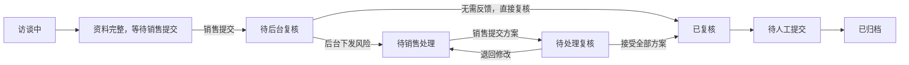

# 风险反馈闭环与送审状态优化设计

日期：2026-07-27  
状态：待书面确认

## 1. 目标

在现有域外合同前置审批系统中增加可审计的风险处理闭环：

1. 销售完成访谈并主动提交后台复核。
2. 系统计算风险，后台确认需要销售处理的风险及处置要求。
3. 风险下发移动端，销售提交结构化处理方案。
4. 后台接受方案或退回修改。
5. 无待处理风险或所有处理方案均被接受后，项目才完成后台复核。

同时修正“必填完成度 100%，但列表仍显示访谈中”造成的理解歧义。

## 2. 已确认的产品决策

- 采用“后台确认后下发”模式，不将规则命中结果未经审核直接推送给销售。
- 风险规则仍由固定规则引擎计算，后台不能篡改规则命中结果和严重级别。
- 后台可决定哪些已命中的风险需要销售反馈，并为每项风险填写明确的处置要求。
- 首版销售反馈采用结构化表单，不加入附件上传。
- 项目达到 100% 后不自动送审，避免销售尚未确认内容就进入不可编辑状态；必须由销售主动点击“提交后台复核”。
- 所有下发、提交、退回、接受动作必须记录操作人、时间和意见。

## 3. 流程状态

新增两个项目状态：

- `risk_response_required`：后台已下发风险，等待销售提交处理方案。
- `risk_response_submitted`：销售已提交处理方案，等待后台复核。

完整状态流：



“资料完整，等待销售提交”是 `interviewing` 状态下的计算型展示状态，不新增持久化枚举。这样既保留显式送审动作，也避免显示成笼统的“访谈中”。

## 4. 数据模型

项目新增 `riskFeedbacks` 数组。每条记录对应一次被后台下发的规则风险，并保存风险快照，避免后续规则更新影响历史记录。

```ts
interface RiskFeedback {
  id: string;
  riskRuleId: string;
  riskSnapshot: {
    title: string;
    severity: 'blocking' | 'high' | 'medium';
    reason: string;
    impact: string;
  };
  requirement: string;
  status: 'awaiting_sales' | 'awaiting_review' | 'accepted';
  dispatchedBy: string;
  dispatchedAt: string;
  response?: {
    decision: 'mitigate' | 'accept_with_controls' | 'request_exception';
    plan: string;
    owner: string;
    dueDate: string;
    submittedBy: string;
    submittedAt: string;
  };
  review?: {
    decision: 'accepted' | 'returned';
    comments: string;
    reviewedBy: string;
    reviewedAt: string;
  };
  history: Array<{
    action: 'dispatched' | 'submitted' | 'returned' | 'accepted';
    operator: string;
    comments?: string;
    at: string;
  }>;
}
```

旧项目没有 `riskFeedbacks` 时按空数组读取，确保现有 JSON 数据兼容，不要求手工迁移。

退回修改后沿用同一条反馈记录，保留历史事件；销售再次提交时覆盖当前 `response`，但旧提交动作仍保存在 `history` 中。

## 5. 后台功能

### 5.1 下发风险

仅 `pending_review` 状态可下发风险。后台人员：

1. 勾选一项或多项已命中的风险。
2. 为每项风险填写“要求销售反馈”的说明。
3. 填写下发人姓名。
4. 点击“下发销售处理”。

成功后项目进入 `risk_response_required`。

### 5.2 复核处理方案

在 `risk_response_submitted` 状态下，后台并列展示：

- 原始规则结论与证据；
- 后台下发要求；
- 销售处理选择、具体方案、责任人和完成日期；
- 完整操作时间线。

后台可：

- 接受单项方案；
- 填写原因并退回单项方案；
- 当全部方案被接受时完成后台复核。

只要存在被退回或尚未接受的反馈，项目就不能进入 `reviewed`。

## 6. 移动端功能

销售使用原审批链接和身份信息恢复项目。

当项目为 `risk_response_required` 时，不再进入语音访谈页面，而是直接进入“风险处理”页面。每项待处理风险显示：

- 风险标题和严重级别；
- 风险原因与影响；
- 后台处置要求；
- 处理方式：
  - 采取措施消除或降低风险；
  - 接受风险并落实管控；
  - 申请例外审批；
- 具体处理方案；
- 责任人；
- 预计完成日期。

以上字段均为必填。全部待处理风险填写完成后，销售一次性提交后台复核，项目进入 `risk_response_submitted`。

当后台退回时，移动端显示退回意见和历史方案，允许修改后再次提交。

当项目进入 `reviewed` 或后续状态时，移动端只显示只读结果和处理说明，不允许继续修改。

## 7. 100% 状态表达优化

根因是当前“完成度”和“流程状态”属于两个独立维度：

- 100%：所有当前适用的必填字段均有值；
- 访谈中：销售尚未执行送审状态迁移。

保留该业务逻辑，调整表达：

- 管理端列表：当 `interviewing` 且已具备送审条件时，状态文案显示“资料已完整，待销售提交”，操作提示显示“等待销售送审”。
- 销售端：进度达到 100% 且风险证据齐全时，显示固定的成功提示和醒目的“提交后台复核”按钮。
- 提交前弹出确认说明：“提交后将暂时不能修改访谈内容；若后台下发风险，可在本链接继续反馈。”
- 提交成功后立即显示“待后台复核”，避免继续停留在访谈界面。
- 仅字段 100% 但风险证据仍缺失时，显示“必填已完成，仍需补充风险核验信息”，不展示可送审成功态。

## 8. API 设计

新增接口：

- `POST /api/admin/projects/:id/risk-feedbacks`
  - 后台批量下发风险。
- `POST /api/s/:token/risk-feedbacks`
  - 销售提交或重新提交处理方案，正文包含 `projectId`。
- `POST /api/admin/projects/:id/risk-feedbacks/review`
  - 后台批量接受或退回处理方案。

现有项目查询接口返回 `riskFeedbacks`。所有写接口在服务层校验项目状态、风险规则编号、必填字段和合法状态迁移，路由层不直接修改项目对象。

## 9. 错误处理与并发

- 非法状态写入返回明确的业务错误，不使用模糊的“请求失败”。
- 下发时若规则已不再命中，拒绝下发并提示刷新项目。
- 销售重复提交同一内容时通过状态和记录 ID 保持幂等，不新增重复反馈。
- 复核时如有反馈未提交，拒绝完成复核并指出未完成项。
- 继续沿用项目级串行写入机制，避免销售和后台同时更新导致覆盖。

## 10. 测试与验收

### 自动化测试

- 状态机覆盖新增状态及退回路径。
- 仓储 schema 能读取没有 `riskFeedbacks` 的旧项目。
- 服务层覆盖下发、提交、退回、再次提交、全部接受和非法跳转。
- API 覆盖鉴权、校验和业务错误。
- 展示层覆盖“100% 待销售提交”与“100% 但风险证据未齐”的区别。

### 浏览器验收

1. 完成销售访谈至 100%，后台显示“资料已完整，待销售提交”。
2. 销售点击提交，后台变为“待后台复核”。
3. 后台下发“签约客户资信”风险。
4. 手机刷新原链接，直接进入风险处理页。
5. 销售提交方案，后台变为“待处理复核”。
6. 后台退回一次，手机显示意见并可重提。
7. 后台接受方案，项目进入“已复核”。
8. 验证现有无风险项目仍能直接复核、导出和归档。

## 11. 本期不包含

- 风险反馈附件上传；
- 短信、企业微信或邮件主动通知；
- 与外部黑名单、OA、飞书或文件系统集成；
- 后台人工修改固定规则的命中结果或严重级别。

