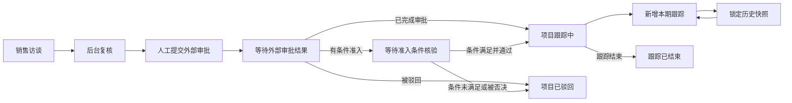

# 合同项目审批结果与跟踪台账设计

日期：2026-07-29  
状态：待书面复核

## 1. 目标

在现有域外合同前置审批系统中补充“外部审批结果”和“合同项目跟踪”能力，形成从销售访谈、后台复核、人工提交，到外部审批、项目执行跟踪和台账导出的完整闭环。

本期同时支持三种数据维护方式：

1. 管理员在项目复核页面逐项维护。
2. 按指定 Excel 模板批量导入多个项目的最新跟踪数据。
3. 按原跟踪汇总表的版式批量导出当前项目台账。

所有跟踪更新采用追加式快照。已提交记录只读保留，后续更新基于上一期数据创建新记录，确保历史可审计。

## 2. 已确认的产品决策

- 原项目、外部审批结果和项目跟踪台账是三个关联但独立的数据对象。
- 项目完成后台复核和人工提交后进入“等待外部审批结果”，不再直接归档结束。
- 外部审批结果支持“已完成审批”“被驳回”“有条件准入”。
- “有条件准入”必须填写准入条件和说明；项目保持待核查，条件核验后才能最终转为通过或驳回。
- 通过审批的项目进入跟踪流程；驳回项目作为终态保留，并进入拒绝项目台账。
- 人工维护和 Excel 导入都生成不可修改的跟踪快照。
- Excel 导入前必须预览匹配结果和错误，确认后才写入。
- Excel 可见列、工作表名称和版式保持与客户提供的工作簿一致。
- 使用主跟踪表空白的 `AN` 列保存隐藏的系统项目 ID，不改变客户看到的列。
- 新增“当前预测 GM1”和“利润承诺是否达成”两个系统结构化字段；导出时将其汇总写入现有“承诺条款达成进展”列，不新增可见 Excel 列。
- 首版不自动对接外部 OA/审批系统，预留适配接口，结果由管理员维护或 Excel 导入。

## 3. 总体流程



外部审批结果与跟踪状态分开存储：

- 审批结果回答“项目是否获准继续”。
- 跟踪状态回答“获准后的项目执行跟踪进行到哪里”。

两者不得用同一个状态字段混合表示。

## 4. 状态设计

### 4.1 项目主状态

在现有 `ProjectStatus` 基础上新增：

- `pending_external_decision`：已人工提交，等待录入外部审批结果。
- `conditional_admission`：有条件准入，等待条件核验。
- `tracking`：已通过审批，项目跟踪中。
- `rejected`：外部审批或条件核验被驳回。
- `tracking_completed`：项目跟踪结束。

兼容规则：

- 旧项目的 `archived` 状态保持原义，不自动迁移。
- 新流程不再由 `pending_manual_submission` 直接跳到 `archived`。
- 人工提交完成后进入 `pending_external_decision`。
- 管理员可将历史已归档项目显式启用跟踪；系统创建一条迁移审计记录，不静默改变历史状态。

### 4.2 审批结果状态

审批结果使用独立枚举：

- `approved`
- `rejected`
- `conditional`

条件核验结果使用：

- `pending`
- `fulfilled`
- `failed`

“有条件准入”初次保存时核验结果固定为 `pending`。后续处理只能选择：

- 条件已满足，最终通过；
- 条件未满足，最终驳回。

### 4.3 跟踪状态

跟踪台账状态与客户 Excel 保持一致：

- `not_started`：尚未开始跟踪；
- `in_progress`：跟踪中；
- `completed`：跟踪完毕/结束。

审批通过时默认创建跟踪台账，状态为 `not_started`。首次提交跟踪快照后改为 `in_progress`；管理员确认跟踪结束后改为 `completed`。

## 5. 数据模型

### 5.1 外部审批记录

项目新增一条当前审批记录和完整事件历史：

```ts
interface ExternalApprovalDecision {
  decision: 'approved' | 'rejected' | 'conditional';
  decisionDate: string;
  externalReference?: string;
  comments?: string;
  conditionalReason?: string;
  conditions?: string;
  verification?: {
    result: 'pending' | 'fulfilled' | 'failed';
    comments?: string;
    verifiedBy?: string;
    verifiedAt?: string;
  };
  recordedBy: string;
  recordedAt: string;
  history: ExternalApprovalEvent[];
}
```

校验规则：

- `decisionDate`、`recordedBy` 必填。
- `conditional` 时 `conditionalReason` 和 `conditions` 必填。
- `rejected` 时 `comments` 必填。
- 条件核验只能发生在当前结果为 `conditional` 且核验状态为 `pending` 时。
- 审批结果更正不覆盖历史，必须追加 `corrected` 事件，并记录更正原因。

### 5.2 项目跟踪台账

```ts
interface ProjectTrackingLedger {
  projectId: string;
  status: 'not_started' | 'in_progress' | 'completed';
  currentSnapshotId?: string;
  snapshots: ProjectTrackingSnapshot[];
  createdAt: string;
  updatedAt: string;
}
```

每次人工提交或 Excel 导入创建一条快照：

```ts
interface ProjectTrackingSnapshot {
  id: string;
  projectId: string;
  effectiveDate: string;
  source: 'manual' | 'excel_import' | 'migration';
  values: ProjectTrackingValues;
  importBatchId?: string;
  contentFingerprint: string;
  note?: string;
  createdBy: string;
  createdAt: string;
}
```

快照提交后不可修改、不可删除。录入错误通过“新增更正记录”处理，更正记录复制上一快照后修改，并在 `note` 中说明原因。

### 5.3 跟踪字段

客户主跟踪表 `B:AM` 的 38 个可见字段全部映射为结构化字段：

#### 基本信息

- 项目跟踪状态
- 更新时间
- 序号
- 销售 BU
- 销售区域
- 销售经理
- 项目名称
- 签约客户
- 最终用户（如有）

#### 项目整体情况

- 特批事项
- 垫资情况
- 项目综合评述
- 项目当前问题

#### 签约跟踪

- 合同形式
- 签约合同金额（CNY）
- 线上审批 GM1
- 签约状态
- 大签日期
- 项目代码

#### 回款执行跟踪

- 款项分布
- 累计到款
- 应收金额
- 应收款款项名称
- 应收日期
- 应收款测收日期
- 回款分析说明

#### 交付执行跟踪

- 项目状态
- 当前里程碑阶段
- 当前里程碑计划完成时间
- 挂牌阶段
- 交付分析说明

#### 供应商交付执行跟踪

- 采购合同
- 采购合同付款节奏
- 累计已付款
- 采购分析说明

#### 事业部跟踪反馈

- 事业部承诺条款
- 承诺条款达成进展
- 项目最新进展

系统另外维护：

- 当前预测 GM1；
- 利润承诺是否达成：`achieved`、`not_achieved`、`at_risk`、`not_applicable`；
- 系统项目 ID；
- 记录来源、创建人、创建时间和内容指纹。

### 5.4 字段来源

以下字段优先从现有项目和访谈答案自动带入，跟踪页面显示但允许在新快照中更新：

- 销售 BU、销售区域、销售经理；
- 项目名称、签约客户、最终用户；
- 合同金额、线上审批 GM1；
- 特批事项、垫资情况、事业部承诺条款；
- 项目综合评述。

以下字段主要由人工维护或 Excel 导入：

- 签约状态、大签日期、项目代码；
- 回款执行数据；
- 交付和里程碑数据；
- 采购执行数据；
- 当前预测 GM1、利润承诺达成情况；
- 承诺条款达成进展和项目最新进展。

序号、更新时间、跟踪状态和系统项目 ID 由系统生成或控制。

## 6. 管理端交互

### 6.1 项目复核页

在现有“流程处理”区域增加“外部审批结果”卡片：

1. 当前流程状态与最近操作时间。
2. 审批结果单选项：已完成审批、被驳回、有条件准入。
3. 审批日期、外部审批编号、说明。
4. 有条件准入时展开“准入原因”和“准入条件”。
5. 条件待核验时显示“确认条件已满足”和“确认条件未满足并驳回”两个动作。
6. 页面下方展示不可删除的审批事件时间线。

只有管理员可维护审批结果。所有动作要求填写操作人；更正已提交结果时必须填写更正原因。

### 6.2 项目跟踪页签

审批通过后，项目详情显示“项目跟踪”页签，布局按业务分区呈现：

- 顶部：跟踪状态、最新更新时间、当前主要风险和“新增本期跟踪”。
- 中部：签约、回款、利润与承诺、交付、采购、事业部反馈。
- 底部：按时间倒序展示历史快照。

点击“新增本期跟踪”时：

1. 默认复制上一期全部字段。
2. 操作人只更新本期发生变化的内容。
3. 保存草稿时不产生正式快照。
4. 点击“确认本期记录”后校验并生成快照。
5. 已确认记录变灰并只读；其后只能创建下一期或更正记录。

跟踪结束动作与新增快照分开，避免误把一次更新当作项目结束。结束时需要填写结束说明。

### 6.3 台账中心

管理端增加“项目跟踪台账”入口，支持：

- 按 BU、区域、销售经理、跟踪状态、审批结果、更新时间筛选；
- 批量导入；
- 导入历史和失败行下载；
- 按当前筛选结果导出；
- 点击项目进入审批结果或跟踪详情。

## 7. Excel 批量导入

### 7.1 支持范围

首版以客户提供的“OT前置特批跟踪合同”工作表为主数据源，同时识别“EMT前置特批拒绝合同”中的驳回项目。

其他工作表的处理：

- “填表说明”：只读，不导入业务数据。
- “项目预警风险汇总”：导出时由系统重新计算，不作为项目更新源。
- “Sheet1”：导出时重新统计 BU 数量。
- “历史通用审批特批合同”：保留原数据和格式，首版不导入到当前项目。
- “商务部-采购明细”：保留原数据和格式，首版不批量写入项目快照。

### 7.2 项目匹配

每行按以下优先级匹配：

1. 隐藏 `AN` 列中的系统项目 ID；
2. 项目代码或现有商机流水号；
3. 项目名称 + 签约客户 + 销售经理的标准化组合。

名称匹配仅忽略首尾空格、连续空格、全半角和常见标点差异，不使用模糊相似度自动写入。匹配到多个项目时必须人工选择。

未匹配行默认不自动创建项目。管理员可在预览页面选择“关联现有项目”或“跳过”；通过 Excel 新建项目不属于本期范围。

### 7.3 空值与覆盖规则

- 空单元格表示沿用上一快照的值，不表示清空。
- 需要清空字段时，在单元格填写统一清空标记 `#CLEAR`。
- Excel 中存在的非空值覆盖新快照对应字段。
- 日期、金额、比例和枚举必须通过格式校验。
- 同一项目在一个文件中出现多行时，按“更新时间”排序；日期相同且内容不同则标记冲突，不自动选择。

### 7.4 导入预览

上传后先生成预览，不立即写入。预览按行显示：

- 已匹配项目；
- 未匹配项目；
- 重复或歧义匹配；
- 字段格式错误；
- 与当前数据相比将发生的变化；
- 导入时间早于系统最新快照的过期数据。

管理员只能确认无阻塞错误的行。确认导入后生成导入批次、审计记录和项目快照。

### 7.5 幂等与回滚

- 行内容指纹由系统项目 ID、有效日期和标准化后的字段值生成。
- 相同指纹重复导入时标记为“已导入”，不创建重复快照。
- 导入批次不能删除历史快照。
- 如果整个批次在写入过程中发生系统错误，批次内所有行均不落库。
- 业务校验失败的行留在预览结果中，不影响管理员确认其他合法行。

## 8. Excel 导出

### 8.1 导出方式

支持：

- 单项目导出；
- 按台账筛选结果批量导出；
- 全量导出。

导出以客户提供的工作簿为模板克隆，保留：

- 工作表名称与顺序；
- 表头、合并单元格、行高列宽；
- 字体、颜色、边框、对齐；
- 批注、数字格式和日期格式；
- 原有说明页。

### 8.2 数据落表

- 已通过且处于跟踪中的项目写入“OT前置特批跟踪合同”。
- 跟踪结束项目仍保留在主表，项目跟踪状态写为“跟踪完毕/结束”。
- 被驳回项目写入“EMT前置特批拒绝合同”。
- 每个项目只导出最新一条正式快照。
- “项目预警风险汇总”和 BU 数量汇总根据导出范围重新计算。
- 隐藏 `AN` 列写入系统项目 ID，便于下一次批量导入稳定匹配。

“承诺条款达成进展”导出内容按固定顺序组合：

1. 当前预测 GM1；
2. 利润承诺是否达成；
3. 原承诺条款达成进展文本。

系统不改动客户工作簿的可见列结构。

### 8.3 历史导出

台账主导出只表示当前状态。管理员可另外下载“项目跟踪历史明细”，每条快照一行，并包含快照 ID、来源、操作人和记录时间。历史明细是系统审计附件，不要求与客户原工作簿版式一致。

## 9. 服务边界与接口

新增三个领域服务，避免把业务逻辑堆积在路由或现有访谈服务中：

- `ExternalApprovalService`：审批结果、条件核验、状态迁移和审计。
- `ProjectTrackingService`：草稿校验、快照创建、跟踪结束和查询。
- `TrackingWorkbookService`：模板解析、匹配预览、批量导入和原格式导出。

建议接口：

- `POST /api/admin/projects/:id/external-approval`
- `POST /api/admin/projects/:id/external-approval/verify-condition`
- `GET /api/admin/projects/:id/tracking`
- `POST /api/admin/projects/:id/tracking/snapshots`
- `POST /api/admin/projects/:id/tracking/complete`
- `POST /api/admin/tracking/imports/preview`
- `POST /api/admin/tracking/imports/:batchId/confirm`
- `GET /api/admin/tracking/imports/:batchId/errors`
- `GET /api/admin/tracking/export`

所有写接口复用现有管理员鉴权，并在服务层完成状态、字段、并发版本和权限校验。

外部审批系统预留适配器：

```ts
interface ExternalApprovalAdapter {
  getDecision(project: PreauditProject): Promise<ExternalApprovalDecision | null>;
}
```

首版实现返回 `null` 的本地适配器，不阻塞人工维护流程。未来接入 OA 时，适配器只负责取得外部结果，仍由领域服务校验和落库。

## 10. 并发、错误与审计

- 项目和跟踪台账继续使用项目级串行写入，避免后台人工维护与批量导入互相覆盖。
- 提交快照时携带读取到的最新快照 ID；若已被他人更新，返回冲突并要求刷新。
- API 返回明确的业务错误，包括非法状态、缺少条件、项目匹配歧义、过期导入和字段格式错误。
- Excel 原始文件、导入预览、确认结果、操作者和时间形成批次审计记录。
- 审批决定、条件核验、跟踪快照和更正记录均不可物理删除。
- 管理员删除项目时继续遵循现有删除权限；若已有审批或跟踪记录，改为逻辑归档并保留审计数据。

## 11. 兼容与迁移

- 旧 JSON 项目没有新增字段时按“无审批结果、无跟踪台账”读取。
- 不批量自动迁移历史项目。
- 管理员可对 `reviewed`、`pending_manual_submission` 或 `archived` 项目执行“启用项目跟踪”：
  - 选择已通过、被驳回或有条件准入；
  - 填写实际审批日期和迁移说明；
  - 系统生成 `migration` 来源的首条审批事件；
  - 通过项目建立空台账，等待首次跟踪更新。
- 现有销售移动端、风险反馈和前置审批 Excel 导出流程不因本功能改变。

## 12. 测试与验收

### 12.1 自动化测试

- 状态机覆盖通过、驳回、有条件准入、条件核验通过和失败。
- 旧项目数据可无损读取。
- 已提交审批记录和跟踪快照不能修改或删除。
- 新快照正确继承上一期值，并只覆盖本期输入。
- `#CLEAR` 能显式清空可空字段。
- 导入匹配优先级、歧义、重复行、过期数据和幂等指纹。
- 导入批次事务性和并发冲突。
- 导出工作表名称、表头、合并区域、样式和隐藏项目 ID。
- 驳回项目落入拒绝工作表，通过项目落入主跟踪表。
- 汇总表和 BU 统计与导出范围一致。
- 所有新增接口覆盖鉴权和明确业务错误。

### 12.2 浏览器验收

1. 完成一个项目的后台复核和人工提交，状态变为“等待外部审批结果”。
2. 录入“有条件准入”，验证原因和条件必填，项目保持待核查。
3. 确认条件满足，项目进入“尚未开始跟踪”。
4. 新增第一期回款、利润、承诺和进度数据，确认后记录变灰只读。
5. 新增第二期记录，验证默认继承第一期内容，第一期不被覆盖。
6. 上传包含多个项目的客户 Excel，查看匹配、差异和错误预览。
7. 确认合法行，验证每个项目新增一条导入快照，重复确认不产生重复记录。
8. 导出全部项目，验证主跟踪表、拒绝表、风险汇总和 BU 统计。
9. 用导出的文件再次导入，验证隐藏项目 ID 能准确匹配。
10. 验证旧项目和现有移动端访谈、风险反馈流程不受影响。

## 13. 本期不包含

- 外部 OA/审批平台的真实网络对接；
- 销售移动端维护项目跟踪数据；
- 通过 Excel 自动创建全新前置审批项目；
- 跟踪快照的物理删除或覆盖；
- 附件、发票、合同扫描件等文件管理；
- 主动短信、邮件或企业微信提醒；
- 自定义 Excel 可见列和用户自定义报表设计器；
- 对“历史通用审批特批合同”和“商务部-采购明细”工作表进行批量回写。

